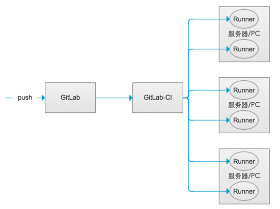

# GitLab介绍

## 一、GitLab介绍
GitLab是由GitLab Inc.开发，使用MIT许可证的基于网络的Git仓库管理工具，且具有wiki和issue跟踪功能。

GitLab 是一个用于仓库管理系统的开源项目。 使用Git作为代码管理工具，并在此基础上搭建起来的web服务。Github是公共的git仓库，而Gitlab适合于搭建企业内部私有git仓库。

## 二、GitLiab架构

###### 官网上将组件架构类比成一个物理的办公室，下面是一些组件的描述：    
- repository：这个仓库用户操作处理一些货物，它们都可以存在在这些仓库中，这个仓库是硬盘或者一些复杂的东西，例如NFS文件系统；  
- Nginx：Nginx扮演一个前台的工作，用户首先来到前台并请求办公室员工做一些事情，实际上就是一个GitLab Web的代理工具；        
- Database： Database就是办公室的一个文件储物柜；    
	- 可以存储仓库中货物的一些操作处理（如：元数据，issue，合并请求 merge request 等）
	- 可以存储用户校验、权限记录
- Redis：Redis是一个包含办公室员工的交流板，作缓存，分发任务用；
- Sidekiq：Sidekiq是一个主要负责发送邮件的办公室员工，他的任务都是来自于Redis交流板中；
- Unicorn：Unicorn是一个主要负责处理快速/普通任务的办公室员工，他与Redis交流板协同处理任务，他的一些具体任务描述；
	- 从Redis储物柜中拿出用户的session检查用户的权限;
	- 给Sidekiq创建任务；
	- 从仓库中取货物或者移动仓库中的货物；
- GitLab-shell：GitLab-shell是第三种办公室员工，他使用一部传真机（SSH）代替前台（HTTP）传递命令，他通过Redis和Sidekiq进行通信，并直接或通过 TCP 间接访问 Unicorn；
- Gitaly：后台服务，专门负责访问磁盘以高效处理 git 操作，并缓存耗时操作。所有的 git 操作都通过 Gitaly 处理；
- GitLab-workhorse：反向代理服务器，可以处理与 Rails 无关的请求（磁盘上的 CSS、JS 文件等），处理 Git Push/Pull 请求，处理到 Rails 的连接（修改由 Rails 发送的响应或发送给 Rails 的请求，管理 Rails 的长期 WebSocket 连接等）

    

     
- GitLab持续集成组件    
	- GitLab-CI：GitLab-CI就是一套配合GitLab使用的持续集成系统（当然，还有其它的持续集成系统，同样可以配合GitLab使用，比如Jenkins）。而且GitLab8.0以后的版本是默认集成了GitLab-CI并且默认启用的。
	- GitLab-Runner：GitLab-Runner是配合GitLab-CI进行使用的。一般地，GitLab里面的每一个工程都会定义一个属于这个工程的软件集成脚本，用来自动化地完成一些软件集成工作。当这个工程的仓库代码发生变动时，比如有人push了代码，GitLab就会将这个变动通知GitLab-CI。这时GitLab-CI会找出与这个工程相关联的Runner，并通知这些Runner把代码更新到本地并执行预定义好的执行脚本。
	- GitLab-Runner可以分类两种类型：Shared Runner（共享型）和Specific Runner（指定型）：
		- Shared Runner：这种Runner（工人）是所有工程都能够用的。只有系统管理员能够创建Shared Runner。
		- Specific Runner：这种Runner（工人）只能为指定的工程服务。拥有该工程访问权限的人都能够为该工程创建Shared Runner。

> 参考文献：    
> https://docs.gitlab.com/ce/development/architecture.html     
> https://blog.csdn.net/kikajack/article/details/80354774    
> https://www.tuicool.com/articles/bYbi2mJ       
> https://docs.gitlab.com/ee/ci/README.html#doc-nav   
> https://www.cnblogs.com/cnundefined/p/7095368.html   
> https://docs.gitlab.com/runner/   
