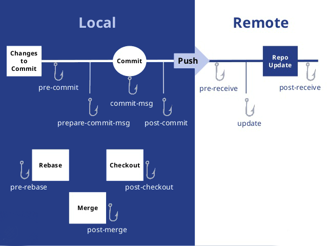

# Git介绍
 
### 一、git是什么？
 　　git是一个分布式版本控制软件，最初由林纳斯·托瓦兹（Linus Torvalds）创作，于2005年以GPL发布。最初目的是为更好地管理Linux内核开发而设计。应注意的是，这与GNU Interactive Tools[6]有所不同。

### 二、git有何用？
##### git的相关介绍
 　　git是用于Linux内核开发的版本控制工具。与CVS、Subversion一类的集中式版本控制工具不同，它采用了分布式版本库的作法，不需要服务器端软件，就可以运作版本控制，使得源代码的发布和交流极其方便。git的速度很快，这对于诸如Linux内核这样的大项目来说自然很重要。git最为出色的是它的合并追踪（merge tracing）能力。   
##### git的主要功能： 　　
更具体的git可以概括为以下几点功能用处：    
1. 代码托管：现在比较比较流行的代码托管平台有GitHub、Gitee(码云)以及一些可以自己搭建的git代码托管平台，如Ruby实现的gitlab、golang实现的gogs等一些开源平台；    
2. 团队协作：与SVN集中式版本管理系统不同，Git客户端并非仅仅检出文件的最新快照，而是对代码仓库进行完整的镜像，如此，不管哪一个服务器出现故障，任何一个客户端都可以使用自己本地的代码仓库镜像恢复服务器，这是代码完整性的保证性；其次，团队可以根据自身需求选择git的分布式工作流进行工程项目管理，通过pull/push/merge等操作进行仓库版本管理，使得团队协作更加便捷高效。     

### 三、git原理是什么？

#### git的两张原理架构图
      
    
     

#### git库目录
- hooks：存储钩子的文件夹
- logs：存储日志的文件夹
- refs：存储指向各个分支的指针（SHA-1标识）文件
- objects：存放git对象
- config：存放各种设置文档
- HEAD：指向当前所在分支的指针文件路径，一般指向refs下的某文件

#### git几个重要名词
- Workspace：工作区
- Index / Stage：暂存区
- Repository：仓库区（或本地仓库）
- Remote：远程仓库

#### git分布式工作流

##### 集中式工作流
    
集中式工作流是针对与代码仓库来说的，所有开发人员使用同一个代码仓库进行协同工作，所有工作的内容提交到一个Trunk或者Master的分支上。
##### 集成管理者工作流  
   
Git中可以创建多个仓库，集成管理者工作流的核心就是项目的主仓库由“集成者”负责，其它开发人员拥有自己的仓库，开发者把完成的工作提交到自己的公开库中，然后“集成者”从这些公开库中拉取代码，最终合并到主仓库中.
##### 司令官与副官工作流
    
司令官与副官工作流是集成管理者工作流的拓展，引入了多级“集成者”来完成多级的代码合并操作，该模式适用于复杂的多级管理的项目开发.

#### Git钩子（Git Hooks）

- Git和其它版本控制系统一样，能在特定的重要动作发生时触发自定义脚本。
- 客户端钩子：由诸如提交和合并这样的操作所调用；
- 服务器端钩子：作用于诸如接收被推送的提交这样的联网操作。
     

### 四、git什么实现？
Git是Linus Torvalds用C语言实现的，GitHub仓库地址：https://github.com/git/git。（待续）
### 五、git如何应用？

#### 1、新建代码库
	# 在当前目录新建一个Git代码库
	$ git init
	
	# 新建一个目录，将其初始化为Git代码库
	$ git init [project-name]
	
	# 下载一个项目和它的整个代码历史
	$ git clone [url]

#### 2、配置
Git的设置文件为.gitconfig，它可以在用户主目录下（全局配置），也可以在项目目录下（项目配置）。
	
	# 显示当前的Git配置
	$ git config --list
	
	# 编辑Git配置文件
	$ git config -e [--global]
	
	# 设置提交代码时的用户信息
	$ git config [--global] user.name "[name]"
	$ git config [--global] user.email "[email address]"

#### 3、增加/删除文件
	
	# 添加指定文件到暂存区
	$ git add [file1] [file2] ...
	
	# 添加指定目录到暂存区，包括子目录
	$ git add [dir]
	
	# 添加当前目录的所有文件到暂存区
	$ git add .
	
	# 添加每个变化前，都会要求确认
	# 对于同一个文件的多处变化，可以实现分次提交
	$ git add -p
	
	# 删除工作区文件，并且将这次删除放入暂存区
	$ git rm [file1] [file2] ...
	
	# 停止追踪指定文件，但该文件会保留在工作区
	$ git rm --cached [file]
	
	# 改名文件，并且将这个改名放入暂存区
	$ git mv [file-original] [file-renamed]

#### 4、代码提交
	
	# 提交暂存区到仓库区
	$ git commit -m [message]
	
	# 提交暂存区的指定文件到仓库区
	$ git commit [file1] [file2] ... -m [message]
	
	# 提交工作区自上次commit之后的变化，直接到仓库区
	$ git commit -a
	
	# 提交时显示所有diff信息
	$ git commit -v
	
	# 使用一次新的commit，替代上一次提交
	# 如果代码没有任何新变化，则用来改写上一次commit的提交信息
	$ git commit --amend -m [message]
	
	# 重做上一次commit，并包括指定文件的新变化
	$ git commit --amend [file1] [file2] ...

#### 5、分支
	
	# 列出所有本地分支
	$ git branch
	
	# 列出所有远程分支
	$ git branch -r
	
	# 列出所有本地分支和远程分支
	$ git branch -a
	
	# 新建一个分支，但依然停留在当前分支
	$ git branch [branch-name]
	
	# 新建一个分支，并切换到该分支
	$ git checkout -b [branch]
	
	# 新建一个分支，指向指定commit
	$ git branch [branch] [commit]
	
	# 新建一个分支，与指定的远程分支建立追踪关系
	$ git branch --track [branch] [remote-branch]
	
	# 切换到指定分支，并更新工作区
	$ git checkout [branch-name]
	
	# 切换到上一个分支
	$ git checkout -
	
	# 建立追踪关系，在现有分支与指定的远程分支之间
	$ git branch --set-upstream [branch] [remote-branch]
	
	# 合并指定分支到当前分支
	$ git merge [branch]
	
	# 选择一个commit，合并进当前分支
	$ git cherry-pick [commit]
	
	# 删除分支
	$ git branch -d [branch-name]
	
	# 删除远程分支
	$ git push origin --delete [branch-name]
	$ git branch -dr [remote/branch]

#### 6、标签
	
	# 列出所有tag
	$ git tag
	
	# 新建一个tag在当前commit
	$ git tag [tag]
	
	# 新建一个tag在指定commit
	$ git tag [tag] [commit]
	
	# 删除本地tag
	$ git tag -d [tag]
	
	# 删除远程tag
	$ git push origin :refs/tags/[tagName]
	
	# 查看tag信息
	$ git show [tag]
	
	# 提交指定tag
	$ git push [remote] [tag]
	
	# 提交所有tag
	$ git push [remote] --tags
	
	# 新建一个分支，指向某个tag
	$ git checkout -b [branch] [tag]

#### 7、查看信息
	
	# 显示有变更的文件
	$ git status
	
	# 显示当前分支的版本历史
	$ git log
	
	# 显示commit历史，以及每次commit发生变更的文件
	$ git log --stat
	
	# 搜索提交历史，根据关键词
	$ git log -S [keyword]
	
	# 显示某个commit之后的所有变动，每个commit占据一行
	$ git log [tag] HEAD --pretty=format:%s
	
	# 显示某个commit之后的所有变动，其"提交说明"必须符合搜索条件
	$ git log [tag] HEAD --grep feature
	
	# 显示某个文件的版本历史，包括文件改名
	$ git log --follow [file]
	$ git whatchanged [file]
	
	# 显示指定文件相关的每一次diff
	$ git log -p [file]
	
	# 显示过去5次提交
	$ git log -5 --pretty --oneline
	
	# 显示所有提交过的用户，按提交次数排序
	$ git shortlog -sn
	
	# 显示指定文件是什么人在什么时间修改过
	$ git blame [file]
	
	# 显示暂存区和工作区的差异
	$ git diff
	
	# 显示暂存区和上一个commit的差异
	$ git diff --cached [file]
	
	# 显示工作区与当前分支最新commit之间的差异
	$ git diff HEAD
	
	# 显示两次提交之间的差异
	$ git diff [first-branch]...[second-branch]
	
	# 显示今天你写了多少行代码
	$ git diff --shortstat "@{0 day ago}"
	
	# 显示某次提交的元数据和内容变化
	$ git show [commit]
	
	# 显示某次提交发生变化的文件
	$ git show --name-only [commit]
	
	# 显示某次提交时，某个文件的内容
	$ git show [commit]:[filename]
	
	# 显示当前分支的最近几次提交
	$ git reflog

#### 8、远程同步

	# 下载远程仓库的所有变动
	$ git fetch [remote]
	
	# 显示所有远程仓库
	$ git remote -v
	
	# 显示某个远程仓库的信息
	$ git remote show [remote]
	
	# 增加一个新的远程仓库，并命名
	$ git remote add [shortname] [url]
	
	# 取回远程仓库的变化，并与本地分支合并
	$ git pull [remote] [branch]
	
	# 上传本地指定分支到远程仓库
	$ git push [remote] [branch]
	
	# 强行推送当前分支到远程仓库，即使有冲突
	$ git push [remote] --force
	
	# 推送所有分支到远程仓库
	$ git push [remote] --all

#### 9、撤销
	
	# 恢复暂存区的指定文件到工作区
	$ git checkout [file]
	
	# 恢复某个commit的指定文件到暂存区和工作区
	$ git checkout [commit] [file]
	
	# 恢复暂存区的所有文件到工作区
	$ git checkout .
	
	# 重置暂存区的指定文件，与上一次commit保持一致，但工作区不变
	$ git reset [file]
	
	# 重置暂存区与工作区，与上一次commit保持一致
	$ git reset --hard
	
	# 重置当前分支的指针为指定commit，同时重置暂存区，但工作区不变
	$ git reset [commit]
	
	# 重置当前分支的HEAD为指定commit，同时重置暂存区和工作区，与指定commit一致
	$ git reset --hard [commit]
	
	# 重置当前HEAD为指定commit，但保持暂存区和工作区不变
	$ git reset --keep [commit]
	
	# 新建一个commit，用来撤销指定commit
	# 后者的所有变化都将被前者抵消，并且应用到当前分支
	$ git revert [commit]
	
	# 暂时将未提交的变化移除，稍后再移入
	$ git stash
	$ git stash pop
#### 10、其他
	
	# 生成一个可供发布的压缩包
	$ git archive

	# 查找任何提交树或工作目录中的字符串和正则表达式
	￥ git grep 
	

> 参考文献与书籍    
> https://www.cnblogs.com/selimsong/p/9059964.html     
> https://zh.wikipedia.org/wiki/Git     
> http://www.ruanyifeng.com/blog/2015/12/git-cheat-sheet.html     
> https://www.jianshu.com/p/527e34f53b51?   utm_campaign=maleskine&utm_content=note&utm_medium=seo_notes&utm_source=recommendation      
> 《精通Git (第二版)》  