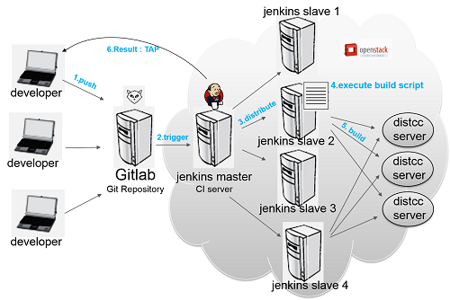

# Jenkins介绍

## 一、Jenkins是什么？
学习jenkins之前我们先来学习几个相关概念。
### 1、了解DevOps
首先了解DevOps，WIKI上是这样描述DevOps，DevOps（Development和Operations的组合词）是一种重视“软件开发人员（Dev）”和“IT运维技术人员（Ops）”之间沟通合作的文化、运动或惯例。透过自动化“软件交付”和“架构变更”的流程，来使得构建、测试、发布软件能够更加地快捷、频繁和可靠。   
DevOps的终极目标是打破信息的孤岛，让开发与运维之间更好的协作。协作目的是确保应用能快速地由开发流转到测试，再到运维。当运维遇到问题的时候，能建制一个完整的闭环回到开发环节。

### 2、持续集成（Continuous integration，简称CI）
持续集成即频繁地（一天多次）将代码集成到主干。
	它的好处主要有两个：
		（1）快速发现错误。每完成一点更新，就集成到主干，可以快速发现错误，定位错误也比较容易。
		（2）防止分支大幅偏离主干。如果不是经常集成，主干又在不断更新，会导致以后集成的难度变大，甚至难以集成。
持续集成的目的，就是让产品可以快速迭代，同时还能保持高质量。它的核心措施是，代码集成到主干之前，必须通过自动化测试。只要有一个测试用例失败，就不能集成。     
Martin Fowler说过，"持续集成并不能消除Bug，而是让它们非常容易发现和改正。" 与持续集成相关的，还有两个概念，分别是持续交付和持续部署。

### 3、持续交付（Continuous delivery，简称CD）
持续交付即频繁地将软件的新版本，交付给质量团队或者用户，以供评审。如果评审通过，代码就进入生产阶段。

### 4、持续部署（continuous deployment，简称CD）
持续部署即持续交付的下一步，指的是代码通过评审以后，自动部署到生产环境。   
持续部署的目标是，代码在任何时刻都是可部署的，可以进入生产阶段。    
持续部署的前提是能自动化完成测试、构建、部署等步骤。   

### 5、下面看几张DevOps系统架构图

    

    
 
第一张是阿里云的DevOps，第二张是腾讯云的DevOps，这两张图都充分体现出开发、运维、测试、产品/运营人员之间的闭环协作关系，同时更能体现了持续集成、交付、部署的工作流程。
## 二、Jenkins有何用？
为了更好地说明Jenkins的功能和作用，上一节中我们引入了devOps和持续集成等概念，而Jenkins跟这几个概念又有什么联系呢？接下来我们看看jenkins到底有什么大作用。
### 1、中间协调器
    
上图很深刻的反应Jenkins的中间协调器功能，Jenkins通过集成各个对应软件的插件，使得原本不相关软件可以协同工作，从而实现了开发、运维、测试、产品/运营一条龙运作，提高工作效率的同时保证工作质量。

### 2、持续、自动构建、测试软件项目
    
    
我所认为的关于持续、自动构建、测试软件项目的流程应类似于以上的流程图。

### 3、监控定时任务
Jenkins提供了一些场景的定时任务，比如构建的定时任务，有点儿类似于Quartz定时任务的实现。

## 三、Jenkins原理是什么？
其实，上面已经把Jenkins的主要功能列举出来，Jenkins主要是集成插件以实现项目持续集成、交付、部署的一系列功能，下面街介绍下三种持续集成方案：
#### 1、CI/CD原理
CI(Continuous Integration)持续集成，CD(Continuous Delivery) 持续交付，通常会采用一些软件如Jenkins、Drone、Travis、Gocd等来辅助项目流程。CI/CD能够与Git SVN等代码管理仓库集成，帮助使用者实现自动化任务。
    

#### 2、Jenkins原理
①定时拉取代码并编译或者自定义触发器hock拉取代码
②打包发布版本
③分析打包编译后的结果
④完成编译后的自定义操作
    

#### 3、Jenkins+Docker原理
①从代码仓库拉取最新的代码。
②Jenkins主机打包编译代码。
③Jenkins主机使用Dockerfile生成最新的镜像，并push到仓库。
④Docker主机pull最新的镜像，删除旧的容器，并生成最新的容器，完成部署上线。
    

## 四、Jenkins如何实现？
源码地址：https://github.com/jenkinsci/jenkins（待续……）

## 五、Jenkins如何应用？
关于Jenkins的应用，在网上找到一篇写的很好的文章：[Jenkins应用](http://skyseraph.com/2016/07/18/Tools/Jenkins%20Gitlab%E6%8C%81%E7%BB%AD%E9%9B%86%E6%88%90%E6%89%93%E5%8C%85%E5%B9%B3%E5%8F%B0%E6%90%AD%E5%BB%BA/ "Jenkins应用")

> 参考文献与书籍
> http://www.360doc.com/content/16/0301/07/412471_538441377.shtml 
> http://www.ruanyifeng.com/blog/2015/09/continuous-integration.html
> https://develop.aliyun.com/devops?spm=5176.128995.655207.1.23336464LHwsbi
> https://cloud.tencent.com/solution/devops
> https://zh.wikipedia.org/wiki/DevOps
> https://www.cnblogs.com/liyuanhong/p/6548925.html
> https://juejin.im/entry/5a97b0def265da23a334a25d
> 《Jenkins权威指南》