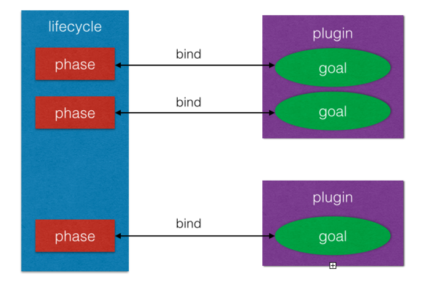

# Maven介绍

## 一、maven是什么？
 　　Apache Maven，是一个软件（特别是Java软件）项目管理及自动构建工具，由Apache软件基金会所提供。基于项目对象模型（缩写：POM）概念，Maven利用一个中央信息片断能管理一个项目的构建、报告和文档等步骤。    
 　　Maven也可被用于构建和管理各种项目，例如C#，Ruby，Scala和其他语言编写的项目。Maven曾是Jakarta项目的子项目，现为由Apache软件基金会主持的独立Apache项目。

## 二、maven有何用？
日常工作中maven使用最多的就是Java工程师使用maven进行工程项目的依赖管理，其实maven主要作用就两个： 
                       　
1. 统一开发规范与工具      
2. 统一管理jar包      

## 三、maven原理是什么？
### 1、两个基本概念
#### （1）、POM
POM的全称是Project Object Model，用通俗点的话说就是对要构建的项目进行建模，将要构建的项目看成是一个对象（Object）。在maven中一个项目都是用一个唯一的坐标（coordinate）来表示，坐标由groupId, artifactId, version, classifier, type这五部分组成。这样来说PO应该也要具备坐标属性。另外，一个项目会依赖另一个项目，所以PO应该具备dependencies属性，同样的，PO对象也有其父对象，用parent属性来表示，并且PO对象会继承其父对象的所有属性。另外一方面，一个项目可能根据不同职责分为多个模块（module），所有模块其实也就是一个单独的项目，只不过这些项目会使用其父对象的一些属性来进行构建。综上，这个用Java描述的的PO对象为：    

```java 
	class PO{
	    private String groupId;
	    private String artifactId;
	    private String version;
	    private String classifier;
	    private String type;
	    private Set<PO> dependencies;
	    private PO parent;
	    private Set<PO> modules;
	}
```

其PO对象所在pom.xml中对应的是<build>标签中的内容。

#### （2）、LifeCycle
Lifecycle顾名思义就是生命周期的意思，一个LifeCycle包括多个phase，正常一个标准的LifeCycle以下的phase:

```
	validate： 用于验证项目的有效性和其项目所需要的内容是否具备
	initialize：初始化操作，比如创建一些构建所需要的目录等。
	generate-sources：用于生成一些源代码，这些源代码在compile phase中需要使用到
	process-sources：对源代码进行一些操作，例如过滤一些源代码
	generate-resources：生成资源文件（这些文件将被包含在最后的输入文件中）
	process-resources：对资源文件进行处理
	compile：对源代码进行编译
	process-classes：对编译生成的文件进行处理
	generate-test-sources：生成测试用的源代码
	process-test-sources：对生成的测试源代码进行处理
	generate-test-resources：生成测试用的资源文件
	process-test-resources：对测试用的资源文件进行处理
	test-compile：对测试用的源代码进行编译
	process-test-classes：对测试源代码编译后的文件进行处理
	test：进行单元测试
	prepare-package：打包前置操作
	package：打包
	pre-integration-test：集成测试前置操作   
	integration-test：集成测试
	post-integration-test：集成测试后置操作
	install：将打包产物安装到本地maven仓库
	deploy：将打包产物安装到远程仓库
```
而phase就相当于对应java的一个接口定义，而此时引入另一个概念---goal，goal就是一个phase的具体实现，一个goal在maven中就是一个Mojo（Maven old java object）。Mojo抽象类中定义了一个execute()方法，一个goal的具体动作就是在execute()方法中实现。而goal对应的就是maven pom.xml中的<plugins>。

     

综上，总结以上几个概念：
1. POM(Project Object Model)：工程对象模型，对应pom.xml中的<build>。
2. LifeCycle:maven的的生命周期对应多个phase，phase有对应一个具体的动作实现goal，吗，每个phase都会对应一个具体的goal，goal对应pom.xml中的<plugins>。

## 四、maven什么实现？
maven是使用Java实现，Githu上的地址：https://github.com/apache/maven。（待续）

## 五、maven什么应用？
maven主要用于管理工程依赖与编译工程，可以作为持续集成工具的一部分，下面主要介绍一些常用命令：

#### 1、mvn常用参数
	mvn -e 显示详细错误
	mvn -U 强制更新snapshot类型的插件或依赖库（否则maven一天只会更新一次snapshot依赖）
	mvn -o 运行offline模式，不联网更新依赖
	mvn -N 仅在当前项目模块执行命令，关闭reactor
	mvn -pl module_name在指定模块上执行命令
	mvn -ff 在递归执行命令过程中，一旦发生错误就直接退出
	mvn -Dxxx=yyy 指定java全局属性
	mvn -Pxxx 引用profile xxx

#### 2、Build Lifecycle中介绍的命令
	mvn test-compile 编译测试代码
	mvn test 运行程序中的单元测试
	mvn compile 编译项目
	mvn package 打包，此时target目录下会出现maven-quickstart-1.0-SNAPSHOT.jar文件，即为打包后文件
	mvn install 打包并安装到本地仓库，此时本机仓库会新增maven-quickstart-1.0-SNAPSHOT.jar文件。

#### 3、maven日用三板斧
	mvn archetype:generate 创建maven项目
	mvn package 打包，上面已经介绍过了
	mvn package -Prelease打包，并生成部署用的包，比如deploy/*.tgz
	mvn install 打包并安装到本地库
	mvn eclipse:eclipse 生成eclipse项目文件
	mvn eclipse:clean 清除eclipse项目文件
	mvn site 生成项目相关信息的网站
	mvn archetype:generate 创建maven项目
	mvn validate 验证项目是否正确
	mvn jar:jar 只打jar包
	mvn source:jar 生成源码jar包
	mvn generate-sources 产生应用需要的任何额外的源代码
	mvn compile 编译源代码
	mvn verify 运行检查
	mvn idea:idea 生成idea项目
	mvn:deploy 发布项目到远程仓库
	mvn integration-test 在集成测试可以运行的环境中处理和发布包
	mvn dependency:tree 显示maven依赖树
	mvn dependency:list 显示maven依赖列表
	mvn dependency:sources 下载依赖包的源码
	mvn install:install-file -DgroupId=packageName -DartifactId=projectName -Dversion=version -Dpackaging=jar -Dfile=path 安装本地jar到本地仓库

#### 4、web项目相关命令
	mvn tomcat:run 启动tomcat
	mvn jetty:run 启动jetty
	mvn tomcat:deploy 运行打包部署
	mvn tomcat:undeploy 撤销部署
	mvn tomcat:start 启动web应用
	mvn tomcat:stop 停止web应用
	mvn tomcat:redeploy 重新部署
	mvn war:exploded tomcat:exploded 部署展开的war文件


> 参考文献与书籍   
> https://zh.wikipedia.org/wiki/Apache_Maven    
> https://www.jianshu.com/p/0fb5e3fb704d    
> https://zhuanlan.zhihu.com/p/29208926 